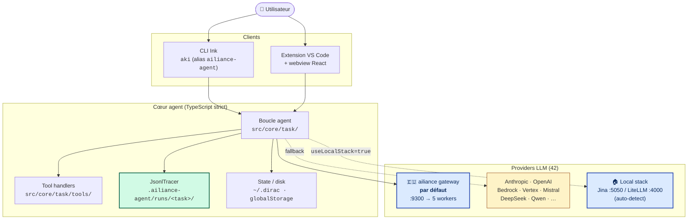
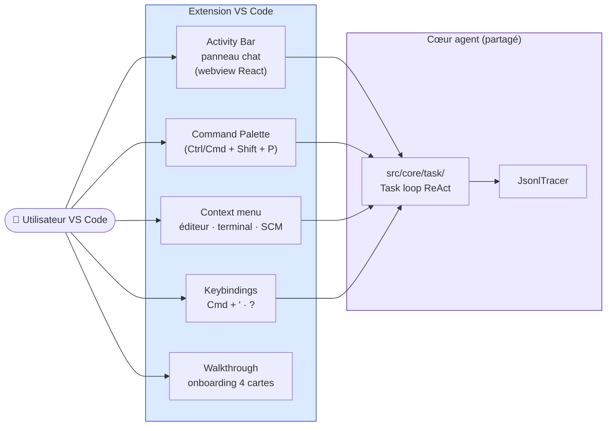
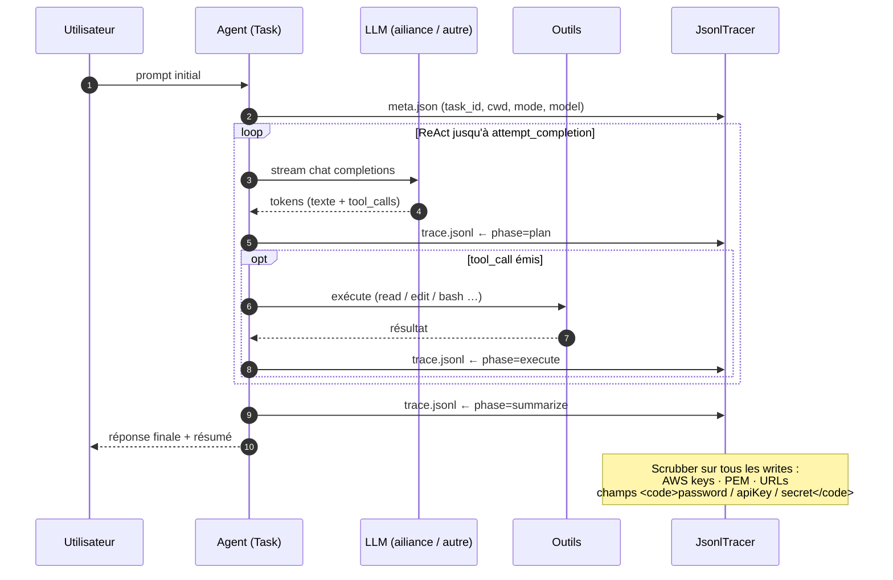
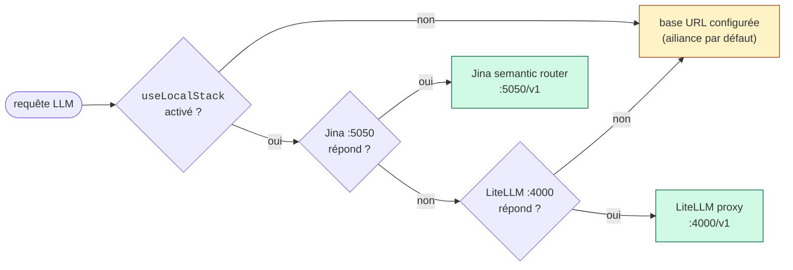

<div align="center">

# ailiance-agent

### Agent de code souverain — extension VS Code + CLI Ink, audit JSONL EU AI Act, branché sur la passerelle ailiance par défaut

[](CHANGELOG.md)
[](LICENSE)
[](https://github.com/ailiance/ailiance)
[](https://github.com/dirac-run/dirac)
[](src/core/tracing/JsonlTracer.ts)
[](https://github.com/ailiance/ailiance)

CLI : **`aki`** (alias `ailiance-agent`) · Extension VS Code · UI webview React · Provider par défaut : passerelle [ailiance](https://github.com/ailiance/ailiance) (`http://studio:9300`)

</div>

---

## C'est quoi

Un agent de code conversationnel forké de [Dirac](https://github.com/dirac-run/dirac) (lui-même basé sur [Cline](https://github.com/cline/cline)) avec **trois différences qui comptent** :

1. **Tracing JSONL EU AI Act** — chaque tour de plan / d'outil est écrit dans `.ailiance-agent/runs/<task_id>/`, secrets scrubés, audit prêt pour Annex IV §1(c).
2. **Backend ailiance par défaut** — la passerelle souveraine 5 workers (Apertus, Devstral, EuroLLM, Gemma 3, Qwen3-Next) au lieu d'OpenAI/Anthropic. 41 autres providers branchables (Bedrock, Vertex, DeepSeek, Mistral, OpenRouter, etc.).
3. **Télémétrie désactivée** — upstream Dirac envoie des events à PostHog. Ce fork coupe tout. Aucune donnée ne sort de l'hôte.

### Vue d'ensemble



## v0.5.0-beta — Universal tool calling

ailiance-agent now ships a full agentic loop with tool emulation that works
across **every** EU-sovereign worker on the cluster:

- **Qwen 32B AWQ** (primary, vLLM native function calling)
- **Eurollm 22B**, **Apertus 70B**, **Devstral 24B** (worker-side emulation)
- **Gemma 3 4B** (gateway-side emulation)

The gateway force-routes any request with `tools[]` to the most reliable
worker, so file editing (`write_to_file`, `edit_file`, `read_file`) and
command execution (`execute_command`) work end-to-end with `aki` running
against your local stack.

See [`docs/local-router.md`](./docs/local-router.md) and [`CHANGELOG.md`](./CHANGELOG.md) for details.

### What's new in v0.5

- **Universal tool emulation** — 5 formats parsed in LocalRouter (`<tool_call>`,
  ` ```tool `, ` ```json `, ` ```bash `, ` ```tool_code `, plain `read_file("...")`)
- **Force-route to tool-capable workers** — requests with `tools[]` prioritize
  `supportsTools:true` workers automatically
- **`aki timeline`** — Ink CLI view of task history grouped by day with emoji
  classification and cursor navigation
- **Anti-hallucination guard** — "TOOL CONSTRAINTS" section in system prompt
  prevents workers from inventing tool names (`digikey:`, `bom:`, `kicad:` etc.)
- **Imperative verbs → ACT** — "fais/fait/écris/ajoute/réalise/génère/construis/
  implémente" always trigger Act mode regardless of prompt length
- **`function.id` propagation fix** — critical fix for multi-turn tool calls
  (commit `783cc66`). Previously `tool_result` fell back to plain text, breaking
  the OpenAI tools protocol. Now `toolUseIdMap` maps correctly across turns.

## v0.4 highlights

- **Plugin marketplace**: `aki plugin install <github-url>` to install Claude Code plugins
- **MCP integration**: discover and use MCP servers from installed plugins
- **LocalRouter** (in-process LLM router): cache, health monitoring, ctx-aware skip,
  SSE streaming. See [docs/local-router.md](./docs/local-router.md).
- **Local stack** (`aki stack {start,stop,status}`): managed LiteLLM proxy + Jina
  semantic router. See [docs/local-stack.md](./docs/local-stack.md).
- **Auto plan/act mode** (opt-in): `autoModeFromPrompt: true` to choose mode
  from prompt content. See [docs/auto-mode.md](./docs/auto-mode.md).
- **Web UI** at `http://127.0.0.1:25463` with worker status dashboard, SPA standalone
  on `/spa`, gRPC HTTP backend on `/grpc/StackService/*`.
- **Refactor**: Task class reduced from 1970 → 592 lines (-70%) for maintainability.
- **+170 tests** (1047 → 1238), 0 régressions.

## Démarrer en 30 secondes

```bash
# Installation globale (Node 20 / 22 / 24 — pas Node 25)
npm install -g ailiance-agent

# Premier prompt — passerelle ailiance par défaut (https://gateway.ailiance.fr/v1)
aki "résume-moi ce dépôt en 5 puces"

# Provider explicite
aki --provider anthropic --model claude-opus-4-7 "ajoute un test pour foo()"

# Mode plan (réfléchit avant d'agir)
aki -p "refactor le module bar/ en deux modules"
```

### Modes de lancement

| Commande | Comportement |
|----------|--------------|
| `ailiance-agent` (ou `aki`) sans argument | TUI interactive (Ink/React). **Requiert un vrai TTY** (Warp / iTerm / zellij / tmux). Bail clair si lancé en pipe / subprocess / CI. |
| `ailiance-agent "<task>"` | Run one-shot avec le prompt positionnel. Pas besoin de TTY. |
| `echo "<task>" \| ailiance-agent` | Run one-shot via stdin pipé. Le contenu pipé devient le prompt. |
| `cat file.md \| ailiance-agent "résume"` | Stdin pipé prepend au prompt positionnel. |
| `ailiance-agent --continue` | Reprend la dernière task du `cwd` courant. |
| `ailiance-agent --acp` | Mode Agent Client Protocol pour intégration éditeur (Zed, etc.). |
| `ailiance-agent t -y "<task>"` | Sous-commande `task` (alias `t`) avec yolo mode (auto-approve actions). |

Override de la passerelle (par exemple en mobilité / on-tailnet) :

```bash
# On-tailnet, moins de latence (skip Cloudflare hop)
AILIANCE_GATEWAY="http://electron-server:9300/v1" aki "..."

# Endpoint custom (OpenAI-compatible)
AILIANCE_GATEWAY="https://my-proxy.example.com/v1" aki "..."
```

L'extension VS Code s'installe via le `.vsix` du repo (paquet `ailiance-agent-0.3.1.vsix`).

## Outils de l'agent — read / write / bash

L'agent dispose de 27 outils canoniques (`DiracDefaultTool`) ; les trois principaux sont :

| Outil | Enum | Handler | Limite |
|-------|------|---------|--------|
| `read_file` | `FILE_READ` | `ReadFileToolHandler` | 50 KB par fichier (PDF/code/Word via `extractFileContent`) |
| `write_to_file` | `FILE_NEW` | `WriteToFileToolHandler` | Pas de cap, mais content tronqué côté UI streamée |
| `execute_command` | `BASH` | `ExecuteCommandToolHandler` | Output 10 KB head/tail, timeout 30 s (300 s pour long-runners) |

### Auto-approve — 3 modes

| Mode | Comment | Effet |
|------|---------|-------|
| **yolo** (`-y`) | flag CLI ou toggle session | Approuve TOUT (read + write + bash + browser), sauf `hard_deny` zone shell |
| **autoApproveAll** | toggle persistant TUI | Idem yolo mais entre sessions |
| **per-action** | `autoApprovalSettings.actions.{readFiles, editFiles, executeCommands, useBrowser}` | Granulaire ; par défaut tout `false` → approbation manuelle de chaque appel |

### Zones de sécurité shell (`execute_command`)

Le `zoneClassifier` (`src/core/safety/zoneClassifier.ts`) classe chaque commande dans 3 zones :

#### Zone `auto_ok` — exécutées sans prompt
Commandes lecture-seule ou outils de build standards :

```
ls, cat, head, tail, find, wc, file
pytest, uv, cargo, npm, pnpm, yarn, bun, make, cmake, go, rustc, ctest
black, ruff, prettier, rustfmt, gofmt, clang-format
git status / diff / log / show / branch / tag / remote
```

#### Zone `confirm` — toujours approbation explicite
Commandes avec effets de bord network / package / push :

```
{npm,pnpm,yarn,pip,uv,cargo} install/add/update/publish
git push, git commit (write)
docker run / build / push
curl / wget / ssh / scp / rsync (network egress)
```

Même en yolo mode, ces commandes demandent confirmation si `autoApprovalSettings.actions.executeCommands` est `false`.

#### Zone `hard_deny` — refusées TOUJOURS (exit code 8)

```
rm -rf <path>                    rm -r <path>
dd of=/dev/...                   mkfs.<fs>
shutdown / reboot / halt         sudo / su / doas
:(){ :|:& };:                    (fork bomb)
curl ... | sh                    (pipe-to-shell)
> /dev/sd[a-z]                   (raw disk write)
chmod 777 -R /                   chown -R root /
```

Yolo mode ne déverrouille **pas** cette zone. Le LLM reçoit l'exit code 8 et doit choisir une alternative.

### Long-runners — timeout 300 s

Pour ces commandes le timeout par défaut passe de 30 s à 5 minutes :

```
{npm,pnpm,yarn,bun} install/ci/build/test
{pip,uv,poetry,pipenv} install
{cargo,go,mvn,gradle} build/test/install
make, cmake, ctest
pytest, tox, nox, jest, vitest, mocha
docker/podman build
torchrun, deepspeed, accelerate launch
{rails,alembic,prisma,django} migrate
ffmpeg
python ... train|finetune
```

### XML hallucination fallback (v0.7)

Quand un backend MLX (Mistral-Medium-128B, Devstral, etc.) sans native function calling reçoit un schéma `tools[]`, il émet parfois du XML hallucination :

```xml
<function=list_files>
<parameter=paths>["."]</parameter>
</function>
```

Le CLI parse ces blocs en `ToolUse` synthétiques (cf. `src/utils/parse-hallucinated-tool-xml.ts`), valide chaque nom contre `DiracDefaultTool` (avec alias map : `bash`/`grep`/`writefile`/`listfiles` mappés à leur enum canonique), et dispatche via le même handler que les tool_calls natifs. Le root-cause fix vit dans la gateway (`FC_FORCE_ROUTE_PORT`) qui redirige les `tools[]` vers le worker natif-FC Qwen 32B, mais ce parser CLI reste comme defense-in-depth.

## Extension VS Code

[](https://github.com/ailiance/ailiance-agent/releases) [](https://github.com/ailiance/ailiance-agent/releases)

```bash
code --install-extension ailiance-agent-0.3.1.vsix
```

Une fois installée, l'extension ajoute :

- **Activity bar** — icône ailiance-agent ouvrant le panneau chat (webview React).
- **Walkthrough** — `ailiance-agent, the EU-sovereign autonomous coding agent` (Hash-anchored edits, AST precision, minimal roundtrips, speed).
- **Context menus** — clic droit sur sélection / terminal / commit / Jupyter cell.
- **Commit messages** — génération automatique sur le bouton de SCM Git.

### Surfaces UI



### Commandes (palette)

| Commande | Effet |
|---|---|
| `New Task` | nouveau dialogue agent |
| `History` | historique des tâches |
| `Settings` | panneau de configuration (provider, modèles, MCP, hooks) |
| `Add to ailiance-agent` | ajoute la sélection ou la sortie terminale au chat |
| `Generate Commit Message with ailiance-agent` | sur le SCM Git, génère un commit via le LLM |
| `Explain with ailiance-agent` | explique la sélection |
| `Improve with ailiance-agent` | propose une amélioration |
| `Generate / Explain / Improve Jupyter Cell` | équivalents notebook |
| `Open Walkthrough` | (re)lance le tutoriel d'accueil |
| `Reconstruct Task History` | reconstruit l'historique depuis les traces JSONL |
| `Accept` / `Reject` / `Save with My Changes` | actions sur les diffs proposés par l'agent |

### Raccourcis

| Touche | Action | Quand |
|---|---|---|
| **`⌘'` / `Ctrl+'`** | `Add to ailiance-agent` | sélection active dans l'éditeur |
| **`⌘'` / `Ctrl+'`** | `Jump to Chat Input` | sans sélection |
| **`?`** | `Generate Commit Message with ailiance-agent` | dans la vue SCM Git |
| **`Enter`** | Reply (review comment) | dans un comment editor `dirac-ai-review` |

### Configuration via le panneau Settings

- Provider + modèle (par défaut `ailiance/auto`, ou `ailiance/devstral-24b` pour le code, etc.)
- API key par provider (chiffrée en `~/.dirac/`)
- Mode plan / act, auto-approve, double-check completion, auto-condense
- `useLocalStack` (auto-detect Jina / LiteLLM)
- `enabledMcpServers`, `mcpToolDenylist`, `mcpToolAllowlist`
- Plugin hooks dirs (`PreToolUse` / `PostToolUse`)
- Sub-agents

### Ce qui sort de l'extension

Aucune télémétrie. Aucune donnée n'atteint `dirac.run` ni PostHog. Les seules requêtes réseau sont :

- Vers le provider LLM choisi (ailiance gateway par défaut, sinon le backend que tu as configuré).
- Vers les serveurs MCP que tu autorises explicitement via `enabledMcpServers`.

Toute l'activité de la tâche est tracée localement dans `<workspace>/.ailiance-agent/runs/<task_id>/` avec scrubber secret-sensible.

## Statusline 2 lignes (v0.3)

Inspirée de Claude Code. Visible en bas de la chat view :

```
 ▸ ~/Documents/Projets/ailiance-agent   master
  devstral-24b      ◉ 73%    ⏱ 11:09:42
 / pour commandes · @ pour fichiers · Shift+↓ pour multi-ligne     ● Plan ○ Act (Tab)
 devstral-24b ███░░░░░░░ (12 345) | 0,082 €
 ailiance-agent (master) | 3 fichiers +120 -45
 ⏵⏵ Auto-approve all enabled (Shift+Tab)
```

- Ligne 1 : `▸ <cwd_complet>` + badge branche (vert si clean, jaune si dirty)
- Ligne 2 : badge magenta modèle + badge contexte coloré (vert ≥ 40 %, jaune ≥ 15 %, rouge sinon) + horloge live

## Ce qui distingue ce fork

| | ailiance-agent | Dirac upstream |
|---|---|---|
| **Provider par défaut** | ailiance gateway (5 modèles EU/CH/Asie souverains) | OpenAI |
| **Télémétrie** | aucune (PostHog désactivé) | events vers `dirac.run` |
| **Audit** | trace JSONL secret-scrubée par tâche, prête pour EU AI Act Annex IV | logs upstream classiques |
| **Routage local** | auto-detect Jina :5050 / LiteLLM :4000 si `useLocalStack` | absent |
| **Branding CLI** | `aki` (court) + statusline 2 lignes | `dirac` |
| **Plugin hooks** | `PreToolUse` / `PostToolUse` câblés au runtime | upstream |
| **Filtrage MCP** | `enabledMcpServers` + `mcpToolDenylist` + `mcpToolAllowlist` | upstream |

Pour le reste — boucle ReAct, hash-anchored parallel edits, AST manipulation, `--auto-condense`, `--double-check-completion`, 41 providers tiers — **on hérite et on garde la compatibilité stricte avec Dirac**. Les améliorations qui ne sont pas spécifiques au fork remontent en upstream.

## Boucle agent + audit JSONL



`.ailiance-agent/runs/<task_id>/`
- **`meta.json`** — task_id, cwd, mode (plan/act), model, provider, début, fin
- **`trace.jsonl`** — un évènement par ligne, phase ∈ `plan / execute / summarize / abort`

Les secrets sont retirés au moment de l'écriture par `JsonlTracer:210` (regex blocklist). Aucune purge a posteriori nécessaire.

## Providers branchables (42)

```mermaid
flowchart LR
    subgraph default["🇪🇺 Par défaut"]
        EU["ailiance gateway<br/>5 workers<br/>:9300/v1"]
    end

    subgraph cloud["☁️ Cloud / hébergés"]
        ANT["Anthropic"]
        OAI["OpenAI"]
        BED["AWS Bedrock"]
        VTX["Vertex AI"]
        AZ["Azure OpenAI"]
        OR["OpenRouter"]
        DS["DeepSeek"]
        QW["Qwen"]
        MIS["Mistral"]
        AIH["AIHubMix<br/>(nouveau v0.3)"]
        ETC["… 30+ autres<br/>cf. <code>src/core/api/providers/</code>"]
    end

    subgraph local["🏠 Local"]
        OL["Ollama"]
        LMS["LM Studio"]
        VLLM["vLLM"]
        TGI["TGI"]
        JINA["Jina :5050<br/>(auto)"]
        LL["LiteLLM :4000<br/>(auto)"]
    end

    cli([aki / ailiance-agent])
    cli --> EU
    cli -.-> cloud
    cli -.-> local

    classDef def fill:#dbeafe,stroke:#1e40af,stroke-width:2px
    classDef cl fill:#fef3c7,stroke:#92400e
    classDef lo fill:#d1fae5,stroke:#065f46
    class default def
    class cloud cl
    class local lo
```

Switch : `aki --provider <nom> --model <id>` ou via le panneau de config. La liste complète : `src/core/api/providers/` (un fichier par backend). 42 providers. Configurations stockées chiffrées dans `~/.dirac/`.

## Stack local auto-detect (v0.3)

Active le routage local dynamique :



Cache 30 s pour ne pas pinger les ports à chaque requête (`src/services/local-stack/LocalStackDetector.ts`). Activable globalement (`useLocalStack` setting key) ou par appel.

## Démarrage rapide (dev)

```bash
git clone https://github.com/ailiance/ailiance-agent.git
cd ailiance-agent
npm run install:all   # bootstrap monorepo (root + cli + webview-ui)
npm run protos        # génère src/generated/ + src/shared/proto/ — REQUIS avant build
npm run build
npm test              # suite mocha (root) + vitest (cli, webview-ui)
npm run lint          # biome
```

Workspaces :

| Path | Rôle |
|------|------|
| `src/` | Extension VS Code + cœur agent (TS strict) |
| `cli/` | CLI Ink (binaire `aki`, build esbuild → `dist/cli.mjs`) |
| `webview-ui/` | Frontend React (Vite + Storybook) |
| `proto/` | Protobuf (gRPC entre host / webview / CLI) |
| `agent-registry/`, `evals/`, `walkthrough/`, `locales/` | Assets non-code |

## Configuration

| Clef | Effet |
|---|---|
| `AGENT_KIKI_GATEWAY=<url>` (env) ou `--baseurl` | Override de la passerelle ailiance par défaut |
| `useLocalStack` (setting) | Active l'auto-detect Jina :5050 / LiteLLM :4000 |
| `enabledMcpServers` (setting) | Liste blanche des serveurs MCP à charger |
| `mcpToolDenylist` / `mcpToolAllowlist` (setting) | Filtrage fin par outil |
| `enableParallelToolCalling` | (déjà existant upstream) — true par défaut |

L'API gateway ailiance attend le suffixe `/v1` (cf. ailiance/src/gateway/server.py — `/v1/chat/completions` est la seule route exposée).

## Quoi regarder où

| Tâche | Location |
|---|---|
| Boucle d'exécution agent / state | `src/core/task/` |
| Provider LLM (anthropic, openai, …) | `src/core/api/providers/` |
| Tracing JSONL + scrubber | `src/core/tracing/JsonlTracer.ts` |
| Persistence disque | `src/core/storage/` |
| Tool handlers | `src/core/task/tools/handlers/` |
| Slash commands | `src/core/slash-commands/` |
| Prompts système | `src/core/prompts/` |
| CLI Ink (TUI) | `cli/src/` |
| Statusline (ChatFooter) | `cli/src/components/ChatFooter.tsx` |
| UI React (panel webview) | `webview-ui/src/` |
| Notes acceptance MVP | `docs/` |

## Changements récents

Voir [`docs/CHANGELOG.md`](docs/CHANGELOG.md). Versions actives :

- **v0.3.1** (2026-05-06) — fleet ailiance passé à 5 workers (Gemma 3, Qwen3-Next 80B MoE)
- **v0.3.0** (2026-05-06) — statusline 2 lignes, local stack auto-detect, plugin hooks runtime, filtrage MCP, provider AIHubMix
- **v0.2.0** (2026-05-05) — convergence agent end-to-end avec ailiance (parsing tool-calls Mistral)
- **v0.1.0** (2026-05-05) — fork initial : tracing JSONL, télémétrie off, defaults ailiance

## Limitations connues (v0)

- **Backend** : par défaut `http://studio:9300/v1` (Tailscale privé). Override via `AGENT_KIKI_GATEWAY` ou `--baseurl`. Le suffixe `/v1` est obligatoire.
- **ailiance LoRA adapters** : worker wrap base + `linear_to_lora_layers`, charge les poids via `strict=False` (`ailiance:1ed24b8`). Adapter par domaine activé quand le header `X-Lora-Domain` est présent.
- **Sentinel apiKey** : sans provider configuré, le fork persiste `openAiApiKey="unused"` comme sentinelle pour le code path openai-compatible. La passerelle ailiance ne valide pas les clés.
- **Trace gap** : les tâches abandonnées avant un tool call valide produisent un dossier de run avec meta/trace vides. Audit downstream : traiter comme `incomplete`.
- **Node.js v25 non supporté** (bug V8 Turboshaft upstream). Utiliser Node 20, 22 ou 24 LTS.
- **Pas de rotation des traces** : `<cwd>/.ailiance-agent/runs/` s'accumule sans purge auto. Nettoyage manuel jusqu'à v0.4.

## Origine et licence

Fork de [Dirac](https://github.com/dirac-run/dirac), lui-même basé sur [Cline](https://github.com/cline/cline). Les améliorations qui ne sont pas spécifiques au fork (boucle agent, optimisations de contexte, suite d'évals, parallel edits, AST manipulation, sub-agents) viennent d'upstream et restent compatibles. License **Apache-2.0**, préservée.

---

<original Dirac README below>

# Dirac - Accurate & Highly Token Efficient Open Source AI Agent

> **Dirac topped the [Terminal-Bench-2 leaderboard](https://huggingface.co/datasets/harborframework/terminal-bench-2-leaderboard/discussions/145) for `gemini-3-flash-preview` with a 65.2% score!**


It is a well studied phenomenon that any given model's reasoning ability degrades with the context length. If we can keep context tightly curated, we improve both accuracy and cost while making larger changes tractable in a single task. 

Dirac is an open-source coding agent built with this in mind. It reduces API costs by **64.8%** on average while producing better and faster work. Using hash-anchored parallel edits, AST manipulation, and a suite of advanced optimizations. Oh, and no MCP.

Our goal: Optimize for bang-for-the-buck on tooling with bare minimum prompting instead of going blindly minimalistic.

## 📊 Evals

Dirac is benchmarked against other leading open-source agents on complex, real-world refactoring tasks. Dirac consistently achieves 100% accuracy at a fraction of the cost. These evals are run on public github repos and should be reproducible by anyone. 

> 🏆 **TerminalBench 2.0 Leaderboard**: Dirac recently topped the [Terminal-Bench-2 leaderboard](https://huggingface.co/datasets/harborframework/terminal-bench-2-leaderboard/discussions/145) with a **65.2%** score using `gemini-3-flash-preview`. This outperforms both Google's official baseline (**47.6%**) and the top closed-source agent Junie CLI (**64.3%**). This was achieved without any benchmark-specific info or any `AGENTS.md` files being inserted.


> **Note on the cost table below**: A bug was discovered in Cline, the parent repo, after running these evals ([issue #10314](https://github.com/cline/cline/issues/10314)). We have submitted a [PR #10315](https://github.com/cline/cline/pull/10315) to fix this. This bug caused the evals for Dirac and Cline to slightly underreport the numbers ($0.03 vs $0.05 per million token cache read). Although there won't be a large difference, we will update the evals soon.

All tasks for all models used `gemini-3-flash-preview` with thinking set to `high`

| Task (Repo) | Files* | Cline | Kilo | Ohmypi | Opencode | Pimono | Roo | **Dirac** |
| :--- | :---: | :---: | :---: | :---: | :---: | :---: | :---: | :---: |
| Task1 ([transformers](https://github.com/huggingface/transformers)) | 8 | 🟢 [(diff)](evals/cline/cline_refactor_DynamicCache) [$0.37] | 🔴 [(diff)](evals/kilo/kilo_code_refactor_DynamicCache_FAILURE) [N/A] | 🟡 [(diff)](evals/ohmypi/ohmypi_refactor_DynamicCache) [$0.24] | 🟢 [(diff)](evals/opencode/opencode_refactor_DynamicCache) [$0.20] | 🟢 [(diff)](evals/pimono/pimono_refactor_DynamicCache) [$0.34] | 🟢 [(diff)](evals/roo/roo_code_refactor_DynamicCache) [$0.49] | **🟢 [(diff)](evals/dirac/dirac_refactor_DynamicCache) [$0.13]** |
| Task2 ([vscode](https://github.com/microsoft/vscode)) | 21 | 🟢 [(diff)](evals/cline/cline_refactor_IOverlayWidget) [$0.67] | 🟡 [(diff)](evals/kilo/kilo_code_refactor_IOverlayWidget) [$0.78] | 🟢 [(diff)](evals/ohmypi/ohmypi_refactor_IOverlayWidget) [$0.63] | 🟢 [(diff)](evals/opencode/opencode_refactor_IOverlayWidget) [$0.40] | 🟢 [(diff)](evals/pimono/pimono_refactor_IOverlayWidget) [$0.48] | 🟡 [(diff)](evals/roo/roo_code_refactor_IOverlayWidget) [$0.58] | **🟢 [(diff)](evals/dirac/dirac_refactor_IOverlayWidget) [$0.23]** |
| Task3 ([vscode](https://github.com/microsoft/vscode)) | 12 | 🟡 [(diff)](evals/cline/cline_refactor_addLogging) [$0.42] | 🟢 [(diff)](evals/kilo/kilo_code_refactor_addLogging) [$0.70] | 🟢 [(diff)](evals/ohmypi/ohmypi_refactor_addLogging) [$0.64] | 🟢 [(diff)](evals/opencode/opencode_refactor_addLogging) [$0.32] | 🟢 [(diff)](evals/pimono/pimono_refactor_addLogging) [$0.25] | 🟡 [(diff)](evals/roo/roo_code_refactor_addLogging) [$0.45] | **🟢 [(diff)](evals/dirac/dirac_refactor_addLogging) [$0.16]** |
| Task4 ([django](https://github.com/django/django)) | 14 | 🟢 [(diff)](evals/cline/cline_refactor_datadict) [$0.36] | 🟢 [(diff)](evals/kilo/kilo_code_refactor_datadict) [$0.42] | 🟡 [(diff)](evals/ohmypi/ohmypi_refactor_datadict) [$0.32] | 🟢 [(diff)](evals/opencode/opencode_refactor_datadict) [$0.24] | 🟡 [(diff)](evals/pimono/pimono_refactor_datadict) [$0.24] | 🟢 [(diff)](evals/roo/roo_code_refactor_datadict) [$0.17] | **🟢 [(diff)](evals/dirac/dirac_refactor_datadict) [$0.08]** |
| Task5 ([vscode](https://github.com/microsoft/vscode)) | 3 | 🔴 [(diff)](evals/cline/cline_refactor_extensionswb_service_FAILURE) [N/A] | 🟢 [(diff)](evals/kilo/kilo_code_refactor_extensionswb_service) [$0.71] | 🟢 [(diff)](evals/ohmypi/ohmypi_refactor_extensionswb_service) [$0.43] | 🟢 [(diff)](evals/opencode/opencode_refactor_extensionswb_service) [$0.53] | 🟢 [(diff)](evals/pimono/pimono_refactor_extensionswb_service) [$0.50] | 🟢 [(diff)](evals/roo/roo_code_refactor_extensionswb_service) [$0.36] | **🟢 [(diff)](evals/dirac/dirac_refactor_extensionswb_service) [$0.17]** |
| Task6 ([transformers](https://github.com/huggingface/transformers)) | 25 | 🟢 [(diff)](evals/cline/cline_refactor_latency) [$0.87] | 🟡  [(diff)](evals/kilo/kilo_code_refactor_latency_WRONG) [$1.51] | 🟢 [(diff)](evals/ohmypi/ohmypi_refactor_latency) [$0.94] | 🟢 [(diff)](evals/opencode/opencode_refactor_latency) [$0.90] | 🟢 [(diff)](evals/pimono/pimono_refactor_latency) [$0.52] | 🟢 [(diff)](evals/roo/roo_code_refactor_latency) [$1.44] | **🟢 [(diff)](evals/dirac/dirac_refactor_latency) [$0.34]** |
| Task7 ([vscode](https://github.com/microsoft/vscode)) | 13 | 🟡 [(diff)](evals/cline/cline_refactor_sendRequest_2missing) [$0.51] | 🟢 [(diff)](evals/kilo/kilo_code_refactor_sendRequest) [$0.77] | 🟢 [(diff)](evals/ohmypi/ohmypi_refactor_sendRequest) [$0.74] | 🟢 [(diff)](evals/opencode/opencode_refactor_sendRequest) [$0.67] | 🟡 [(diff)](evals/pimono/pimono_refactor_sendRequest) [$0.45] | 🟢 [(diff)](evals/roo/roo_code_refactor_sendRequest) [$1.05] | **🟢 [(diff)](evals/dirac/dirac_refactor_sendRequest) [$0.25]** |
| Task8 ([transformers](https://github.com/huggingface/transformers)) | 3 | 🟢 [(diff)](evals/cline/cline_refactor_stoppingcriteria) [$0.25] | 🟢 [(diff)](evals/kilo/kilo_code_refactor_stoppingcriteria) [$0.19] | 🟢 [(diff)](evals/ohmypi/ohmypi_code_refactor_stoppingcriteria) [$0.17] | 🟢 [(diff)](evals/opencode/opencode_refactor_stoppingcriteria) [$0.26] | 🟢 [(diff)](evals/pimono/pimono_code_refactor_stoppingcriteria) [$0.23] | 🟢 [(diff)](evals/roo/roo_code_refactor_stoppingcriteria) [$0.29] | **🟢 [(diff)](evals/dirac/dirac_refactor_stoppingcriteria) [$0.12]** |
| **Total Correct** | | 5/8 | 5/8 | 6/8 | 8/8 | 6/8 | 6/8 | **8/8** |
| **Avg Cost** | | $0.49 | $0.73 | $0.51 | $0.44 | $0.38 | $0.60 | **$0.18** |

> 🟢 Success \| 🟡 Incomplete \| 🔴 Failure

> **Cost Comparison**: Dirac is **64.8% cheaper** than the competition (a **2.8x** cost reduction).
>
> \* Expected number of files to be modified/created to complete the task.
>
> See [evals/README.md](evals/README.md) for detailed task descriptions and methodology.


## 🚀 Key Features

- **Hash-Anchored Edits**: Dirac uses stable line hashes to target edits with extreme precision, avoiding the "lost in translation" issues of traditional line-number based editing.
  
- **AST-Native Precision**: Built-in understanding of language syntax (TypeScript, Python, C++, etc.) allows Dirac to perform structural manipulations like function extraction or class refactoring with 100% accuracy.
  
- **Multi-File Batching**: Dirac can process and edit multiple files in a single LLM roundtrip, significantly reducing latency and API costs.
  
- **High-Bandwidth Context**: Optimized context curation keeps the agent lean and fast, ensuring the LLM always has the most relevant information without wasting tokens.
- **Autonomous Tool Use**: Dirac can read/write files, execute terminal commands, use a headless browser, and more - all while keeping you in control with an approval-based workflow.
- **Skills & AGENTS.md**: Customize Dirac's behavior with project-specific instructions using `AGENTS.md` files. It also seamlessly picks up Claude's skills by automatically reading from `.ai`, `.claude`, and `.agents` directories.
- **Native Tool Calling Only**: To ensure maximum reliability and performance, Dirac exclusively supports models with native tool calling enabled. (Note: MCP is not supported).

## 📦 Installation

### VS Code Extension
Install Dirac from the [VS Code Marketplace](https://marketplace.visualstudio.com/items?itemName=dirac-run.dirac).

### CLI (Terminal)
Install the Dirac CLI globally using npm:
```bash
npm install -g dirac-cli
```

> **Note**: Node.js v25 is currently not supported due to an upstream V8 Turboshaft compiler bug that causes out-of-memory crashes during WASM initialization. Please use Node.js v20, v22, or v24 (LTS versions).

## 🚀 CLI Quick Start 

1. **Authenticate**:
   ```bash
   dirac auth
   ```
2. **Run your first task**:
   ```bash
   dirac "Analyze the architecture of this project"
   ```

### Configuration (Environment Variables)
You can provide API keys via environment variables to skip the `dirac auth` step. This is ideal for CI/CD or non-persistent environments.

For provider-specific setup (e.g. [AWS Bedrock](docs/providers/README.md#aws-bedrock), [Google Cloud Vertex AI](docs/providers/README.md#google-cloud-vertex-ai)), see the [Provider Settings](docs/providers/README.md) guide.

Common API Keys:

- `ANTHROPIC_API_KEY`
- `OPENAI_API_KEY`
- `OPENROUTER_API_KEY`
- `GEMINI_API_KEY`
- `GROQ_API_KEY`
- `MISTRAL_API_KEY`
- `XAI_API_KEY` (x.ai)
- `HF_TOKEN` (HuggingFace)
- ... and others (see `src/shared/storage/env-config.ts` for the full list).

#### Using Any OpenAI compatible endpoint

You can use any OpenAI-compatible provider (e.g., DeepSeek, DeepInfra, OpenRouter, or your own local proxy) by providing the base URL and model ID.

**Environment Variables:**
- `OPENAI_API_BASE`: Your API base URL (e.g., `https://api.deepseek.com/v1`).
- `OPENAI_API_KEY` (or `OPENAI_COMPATIBLE_CUSTOM_KEY`): Your API key.
- `CUSTOM_HEADERS`: Optional custom headers (e.g., `"Authorization=Bearer token,X-Account-Id=123"` or JSON format).

**CLI Example:**
```bash
# Using environment variables
export OPENAI_API_BASE="https://api.yourprovider.com/v1"
export OPENAI_API_KEY="your-api-key"
export CUSTOM_HEADERS="Authorization=Bearer XXX"

dirac "explain Dirac Delta function" \
  # --provider is now optional if OPENAI_API_BASE is set
  --model "your-model-id"
```

**CLI Flag Example:**
```bash
dirac "explain Dirac Delta function" \
  --provider "https://api.deepseek.com/v1" \
  --model "deepseek-v4-pro" \
  --headers "X-Custom-Header=Value"
```


### Common Commands
- `dirac "prompt"`: Start an interactive task.
- `dirac -p "prompt"`: Run in **Plan Mode** to see the strategy before executing.
- `dirac -y "prompt"`: **Yolo Mode** (auto-approve all actions, great for simple fixes).
- `git diff | dirac "Review these changes"`: Pipe context directly into Dirac.
- `dirac history`: View and resume previous tasks.


## 🛠️ Getting Started

1. Open the Dirac sidebar in VS Code.
2. Configure your preferred AI provider (Anthropic, OpenAI, OpenRouter, etc.).
3. Start a new task by describing what you want to build or fix.
4. Watch Dirac go!


## 📈 Star History

<a href="https://star-history.com/#dirac-run/dirac&Date">
  <picture>
    <source media="(prefers-color-scheme: dark)" srcset="https://api.star-history.com/svg?repos=dirac-run/dirac&type=Date&theme=dark" />
    <source media="(prefers-color-scheme: light)" srcset="https://api.star-history.com/svg?repos=dirac-run/dirac&type=Date" />
    
  </picture>
</a>


## 📄 License

Dirac is **open source** and licensed under the [Apache License 2.0](LICENSE).

## 🤝 Acknowledgments

Dirac is a fork of the excellent [Cline](https://github.com/cline/cline) project. We are grateful to the Cline team and contributors for their foundational work.

---

Built with ❤️ by [Max Trivedi](https://www.linkedin.com/in/max-trivedi-49993aab/) at [Dirac Delta Labs](https://dirac.run)
